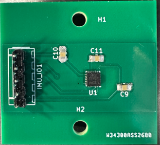

# Tamir Worklog

[[_TOC_]]

# 2024-10-03 - Team Discussion on Scope and Design Review for ProjectDiscussion with Team and Scope of Project and Completion of Design Review

Met up with the team to determine the scope of our project and complete the design review. We agreed on developing a golf swing tracker that attaches to a standard golf club, with embedded sensors such as an MPU9250 sensor and force sensors. We plan to use these sensors to track important features such as acceleration, angular velocity, and orientation. This information will be sent to our web application for subsequent data analysis. Additionally, we identified a stretch goal, which would incorporate machine learning to further interpret the collected data.

# 2024-10-10 - IMU Update

I was updated that we are switching from the MPU9250 to the ICM 20948 due to availability and enhanced support. Therefore, I need to ensure that I research the new IMU thoroughly and determine the differences in terms of programming it. Additionally, I need to examine the datasheet to determine the method of testing in terms of wiring. So far all I've found is that the protocol to transmit data to the ESP32 is SPI which is ideal for easy-to-use programming.

# 2024-10-14 - Discovered Javascript/Typescript Framework For Easily Building Mobile Apps

Searching around the internet, I found out that building mobile apps for iOS can involve hefty fees for gaining Apple developer rights. After talking with my team, we decided in terms of demo purposes it wasn't necessary to have the mobile app on the App Store, so I'm opting to use the 'Expo' framework. This way we can easily build mobile apps for both iOS and android without needing developer rights.

# 2024-10-29 - Determining Wireless Transmission Protocol

After talking with some other students, I'm starting to worry over the transmission speed and reliability of Bluetooth. Additionally, after a bit of research I'm reading that coding with Bluetooth libraries can be slightly tedious within the Arduino IDE, so I'm trying to guage whether user accessibility is more important than speed & development time. Moreover, multiple stack overflows and Arduino discussion boards are talking about how slow bluetooth transmission can be so I plan on talking to my TA about Wi-fi capabilities. 

# 2024-11-8 - Resolution For Wireless Transmission Protocol

Talked with Sanjana about my concerns and she said that it was fine to assume that wifi is available for demo purposes. The main reasoning is that this project is intended for golf training, which could often be performed indoors, so wifi may be readily available.

# 2024-11-12 - Mocked Testing with Mobile App

In preparation for the mock demo, I'm developing a prototype for the mobile app. This involved a couple of key components, but it mostly involved getting the correct libraries installed for my Typescript application and drivers installed for my Arduino IDE to help process the digital data the IMU sends to the ESP-32. I was able to find example code that reads sensor data and prints it out to serial monitor and I was able to get that working. Additionally, I tested out the mobile application by starting up a wifi server on the ESP-32 and have my phone connect to it and display the raw data. 

Additionally, I tested out a pretty non-standard application layer protocol, websockets. Instead of using a standard HTTP connection or a barebone TCP connection, I opted for a websocket connection. This application layer protocol is ideal for real-time transmission since it keeps the benefits of reliability with TCP, but keeps header sizes extremely small (within 20 byte range) compared to HTTP 400B-2MB headers. 

# 2024-11-17 - Thoroughly Examine Research Papers

I meticulously analyzed several research papers to identify metrics relevant to the project. I focused on wrist cock dynamics crucial for analyzing golf swings. These studies provided insights into the biomechanics of golf swings, which I used to develop and inspire equations based on Newtonian physics and kinematics.

$$
v = v_0 + \int a_y \, dt
$$

$$
\text{upwardTrajectory} = a_z(t_\text{impact}) > 0
$$

$$
\theta_\text{wrist}(t) = \arctan\left(\frac{\omega_z(t)}{\omega_y(t)}\right) \cdot \frac{180}{\pi}
$$

# 2024-11-21 - Preliminary Testing With PCBs

This session primarily involved testing out the IMU PCB and seeing if the ESP-32 can detect if there is an IMU hooked up to our bread board. Unfortunately, it is currently unable to do so despite multiple attempts. Most likely, we needed to pull up the interrupt pin but instead left it hanging.

