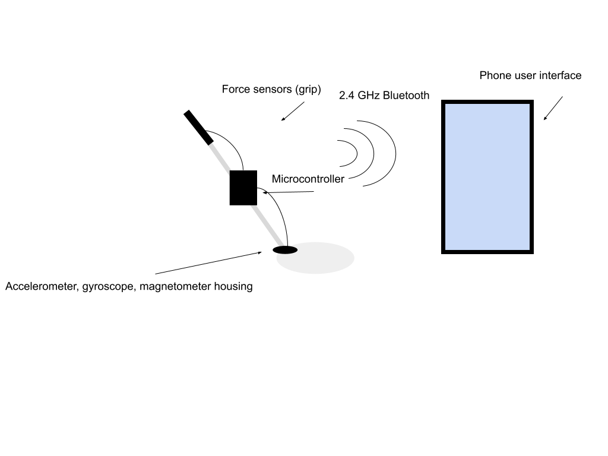
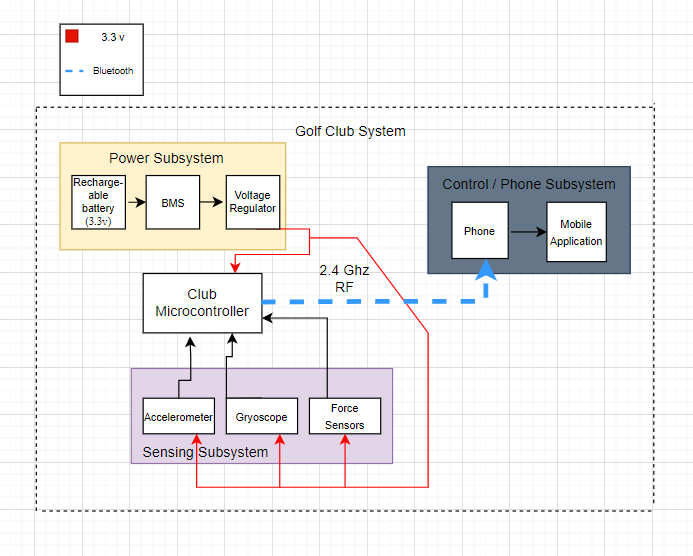

# Real-Time Golf Swing Tracker

Team Members:
- tamirb2
- leuba2
- kijungk3

# Problem

Mastering the golf swing is a complex challenge with nuances that can be difficult to grasp without precise feedback. Current training methods often rely on professional coaching and visual observation, which might not be readily accessible or affordable for all golfers. Additionally, the subtle mechanics of a golf swing, including swing path, speed, and force, are not easily quantifiable through mere observation. There's a growing need for a more accessible and scientific approach to golf training that leverages modern technology to provide real-time, detailed feedback directly to the golfer.

# Solution

We propose to develop the Real-Time Golf Swing Tracker equipped with an integrated sensor system and a companion mobile application to analyze and improve golf swings. The core of our solution involves embedding accelerometers, gyroscopes, and force sensors within the grip of a standard golf club. These sensors will capture critical data points such as swing speed, angle, and grip pressure during each stroke. This data is then processed by a microcontroller that filters and interprets the raw sensor outputs. The processed information is wirelessly transmitted to a mobile application that provides the golfer with immediate visual feedback and historical data analysis.

# Visual Aid

# High-Level Requirements:

All sensors integrated into the Smart Golf Club, including accelerometers, gyroscopes, and force sensors, must maintain a tolerance of accuracy within 20%. This level of precision is essential to ensure that the data collected is consistently reliable and reflects true performance.
The user interface of the Smart Golf Club's accompanying mobile application is designed to display data in real-time, ensuring that all information is updated and presented to the user within 5 seconds following each golf swing. This prompt update allows golfers to immediately see the impact of their swings on parameters such as swing speed, angle, and force, facilitating on-the-spot adjustments and learning.
The total weight of the Smart Golf Club, after integrating all hardware systems including sensors, microcontroller, and power supply, should not exceed a 5% increase over the weight of a standard golf club. This stringent weight threshold is essential to ensure that the club retains a natural feel and balance, allowing golfers to swing with their usual technique without adaptation to added bulk. Maintaining this minimal weight increase is crucial for user acceptance and performance, ensuring that the technological enhancements enhance rather than hinder the golfing experience.

# 2. Block Diagram

# Subsystem overview

## Sensor Subsystem

This subsystem includes accelerometers, gyroscopes, and force sensors integrated into the golf club's grip. These sensors capture real-time data on swing speed, angle, and grip pressure. We plan to use MPU9250, which includes the gyroscope and the accelerometer together. This sensor will be attached right above the golf head, allowing for accurate sensing when the club swings up and down. Also, the FSR06BE sensors will be utilized to sense the grip force from our hands to the golf grip. We would insert sensors under the grip such that the pressure resulting from our hands will be transmitted to the microcontroller, which will be on the golf shaft.

- Accelerometer : Measures the acceleration and deceleration of the golf club to track swing speed.
- Gyroscope : Tracks the orientation and angular velocity to track the angle of the club throughout the swing.
-Magnetometer : Tracks absolute orientation in relation to Earth’s magnetic field to work in tandem with the gyroscope and gather a more accurate reading.
- Force Sensor : Monitors the grip pressure applied by the golfer throughout the swing. If the scope of the project is too small, we also plan to add force sensors on the golf club face to measure the point of contact made between the club and the ball.

## Microcontroller Subsystem

The microcontroller subsystem processes data from the sensors, executes filtering algorithms, and manages wireless data transmission to the mobile application.

- Microcontroller (ESP32-S3-WROOM-1 MCU): Manages real-time data processing from all sensors and supports Bluetooth communication to transmit swing data to the mobile application. Sensors will be connected to the microcontroller through the GPIO and ADC allowing for digital and analog transmission. The microcontroller/PCB will most likely be placed & screwed on the shaft of the club to allow for even distribution of wires between grip sensors and club sensors.

## Power Subsystem

This subsystem ensures that all electronic components within the golf club are adequately powered during use.
- Rechargeable Cable/Battery (3.3 - 5V) : A lightweight, durable battery capable of providing consistent power to necessary subsystems for extended periods, ensuring usability through multiple rounds of golf. A USB port will be utilized to allow for the battery to be recharged.

## Mobile Application and Data Analysis Subsystem

A comprehensive app that receives data from the golf club’s microcontroller. The user interface displays real-time analytics and historical trend analysis to help golfers understand and improve their swing techniques. High-level/process-intensive code will be run from the mobile application to perform any algorithms or potential ML to analyze golf swings. The application will most likely be exclusively hosted as an Android application for easier development.

## Criterion For Success

- **Precision**: The sensor data must be accurate to within a few degrees or percentage points, ensuring that feedback is reliable. 
- **User Interface**: The mobile application must be intuitive and easy to use, providing clear and actionable insights without overwhelming the user. A section will be dedicated to user data & numerics so that users can quickly digest raw data. 
- **Durability**: The Real-Time Golf Swing Tracker must withstand regular use in various weather conditions without sensor or system failure. 

# Subsystem Requirements

## Power Subsystem

The Power Subsystem is responsible for supplying consistent and reliable power to all electronic components within the Smart Golf Club, including the microcontroller and various sensors. It primarily consists of a rechargeable lithium-ion battery and a voltage regulator to ensure a steady output.

**Interfaces**:
Outputs a regulated 3.3V to the Microcontroller and Sensing Subsystem.

Receives charging input via a USB-C port

**Requirements**:
Must supply at least 500mA continuously at 3.3V ± 0.1V.

Must integrate a charging circuit capable of fully charging the battery within 2 hours.

The battery should last for at least 10 holes of golf on a single charge without performance degradation.

## Sensing Subsystem

The Sensing Subsystem includes accelerometers, gyroscopes, and force sensors, each responsible for collecting specific data about the golf swing. The sensors will be placed along the grip to capture user data such as grip strength, swing speed, and club angle. Sensor placement may be extended by placements on the golf head to track the location the golf club hits the golf ball.

**Interfaces**:
Communicates with the Microcontroller via I2C or SPI

**Requirements**:
Sensors must maintain a tolerance of accuracy within 20% to ensure reliable data.

Must function effectively under the environmental conditions typically experienced on a golf course.

Accelerometers and gyroscope must update their readings at least 1000 times per second to capture dynamic swing data accurately.

## Microcontroller Subsystem

The microcontroller serves as the central processing unit of the Smart Golf Club, handling input from the sensors via SPI, processing the data, and transmitting it to the Mobile Application via Wifi or Bluetooth. Placement of microcontroller will most likely be in the middle of the golf club to reduce distance wires have to travel (in the scenario we have sensors both on the grip and the club head)

**Interfaces**:
Receives sensor data via I2C/SPI.

Transmits processed data to the Mobile Application via Bluetooth.

**Requirements**:
Must have sufficient processing power to handle data from multiple sensors without lag, ensuring data processing latency of less than 500 milliseconds.

Requires embedded Bluetooth capability with a range of at least 10 meters to maintain connection with the mobile application.

## Phone Subsystem

The Mobile Application interfaces with the Smart Golf Club to display data in a user-friendly format and stores historical data for progress tracking. This subsystem may be extended by incorporating camera features to record golfers and track their form/technique with pre-compiled data. This may involve machine learning.

**Interfaces**:
Receives data from the Microcontroller via Bluetooth

**Requirements**:
Must update and display data within 5 seconds of receiving it to ensure real-time feedback.

Requires robust error handling to manage potential data transmission errors over Bluetooth.

Should be compatible with major mobile operating systems (iOS and Android) to ensure wide accessibility.

# Tolerance Analysis

## Sensors
The force pressure sensor has a part-to-part repeatability of around 4% and 2% uncertainty of force readings from a single component. Given that, the uneven pressure given by a golf grip, and the variance of data through the microcontroller being received over 2.4GHz RF, we hope to expect a 20% accuracy tolerance of the force sensors.

On the MPU-9250, we can expect a range of 16g for the accelerometer, 2000 dps for the gyroscope, and 4800μT for the magnetometer. Given our application, we can hope to expect a 5% tolerance.

## Wireless communication and user interface

We want at least 1 Mbps, a latency of 20-30 ms, and a less than 1% packet loss from our bluetooth transmission and our android app to crash less than once per hour of use.

## Power

We would aim for our li-ion and voltage regulator to be within 3% range of 3.3V and 10% range for necessary current draw.
